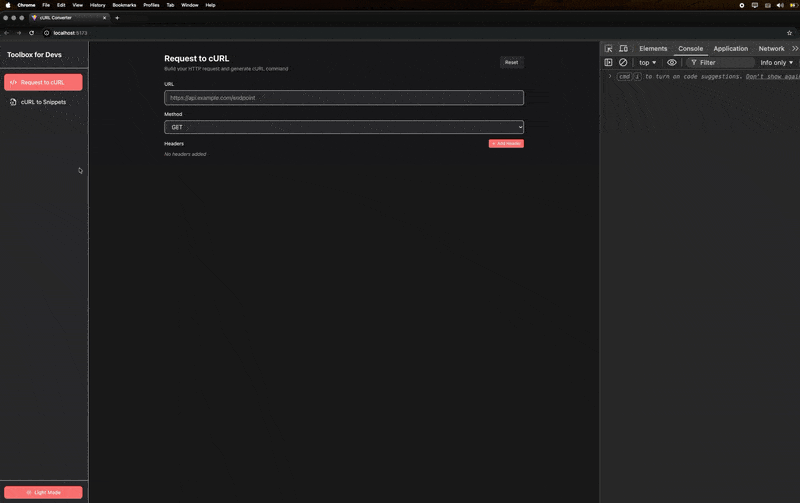
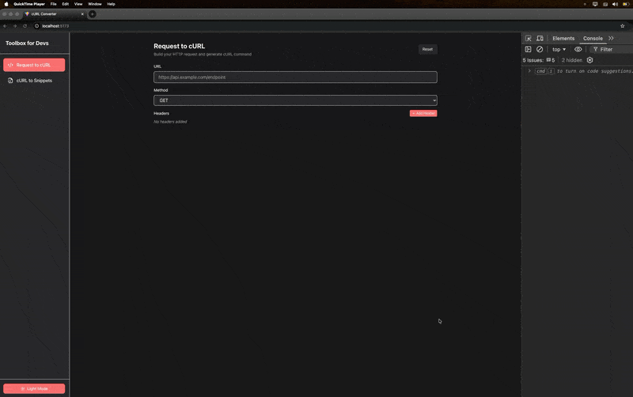
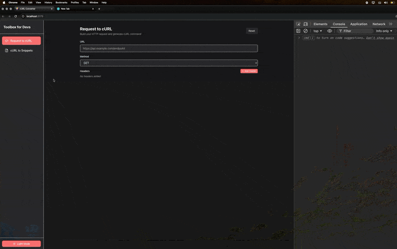
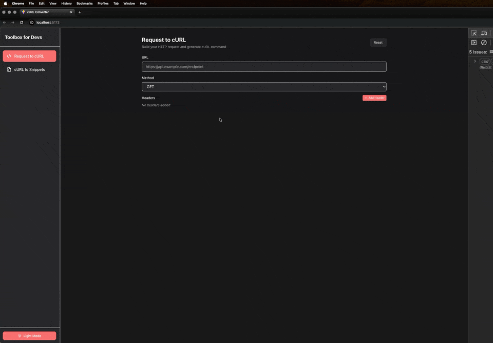

# Toolbox for Devs

A lightweight utility hub designed for developers who need to test APIs and generate code snippets instantly. Built with a focus on speed and accessibility.

## 🚀 The "Why" Behind the Project

As a Front-end engineer, I often need to test APIs quickly without the overhead of creating entire service methods or boilerplates just to verify an endpoint's behavior. While powerful tools like Insomnia and Postman are available, they often require local installation and can feel 'heavy' for simple.

This tool was built to save time and stay focused on complex feature development. It offers a quick interface to:

- Build complex HTTP requests and see the resulting cURL command.
- Convert existing cURL commands into clean, ready-to-use code snippets for various libraries.

**Built in minutes**: This entire project was conceptualized and developed in just a few minutes using advanced AI, demonstrating the power of agentic coding. It's a living project that I plan to expand with more tools in the future.

## 🎬 Demo



## 🔗 Live Preview

Check out the live version of the application here: [https://orafael.dev/toolbox-for-devs/](https://orafael.dev/toolbox-for-devs/)

## ✨ Key Features

### 1. Request to cURL Builder

Construct your HTTP requests with ease. Add headers, set methods (GET, POST, PUT, etc.), and define payloads. The tool generates a perfectly formatted cURL command in real-time.

- **Real-time generation**: See your cURL command update as you type.
- **Header Management**: Easily add, edit, or remove headers with a dedicated UI.

### 2. cURL to Snippets Transformer

Already have a cURL command? Paste it and instantly get the equivalent code in:

- **Fetch API**
- **Axios**
- **XMLHttpRequest**

### 3. Dark & Light Mode

Native support for both themes, ensuring a comfortable experience whether you're working in a bright office or a late-night coding session.

### 4. Data Persistence

Your work is automatically saved even if you refresh the page or close the browser. Using **Local Storage**, the application persists your latest request configuration so you can pick up exactly where you left off.

## 🏗️ Architectural Choice: Lightweight Global State

I chose **Zustand** for state management to maintain a small bundle size while keeping the application logic clean and scalable. It handles everything from theme toggling to complex request building seamlessly.

## 🛠️ Tech Stack

- **React 18** (UI Library)
- **TypeScript** (Type Safety)
- **Tailwind CSS** (Styling/Theming)
- **Zustand** (State Management)
- **Lucide React** (Modern Iconography)
- **Vite** (Build Tool)

## 🎨 Feature Showcase

### Request Builder

Build your request and generate cURL commands instantly.



### Snippet Generator

Convert cURL to Fetch, Axios, or XHR snippets with one click.



### Dark & Light Themes

A cohesive design system that looks stunning in any color scheme.



## 🚀 Getting Started

### Prerequisites

- [Node.js](https://nodejs.org/) (version 18 or higher)
- [npm](https://www.npmjs.com/)

### Installation

1.  Clone the repository:
    ```bash
    git clone https://github.com/orafael93/toolbox-for-devs.git
    ```
2.  Navigate to the project directory:
    ```bash
    cd toolbox-for-devs
    ```
3.  Install dependencies:
    ```bash
    npm install
    ```

### Running Locally

Start the development server:

```bash
npm run dev
```

The app will be available at `http://localhost:5173/toolbox-for-devs`.

## 👨‍💻 Author

**Rafael Pereira**

- Email: orafaeldev@gmail.com
- GitHub: [@orafael93](https://github.com/orafael93)
